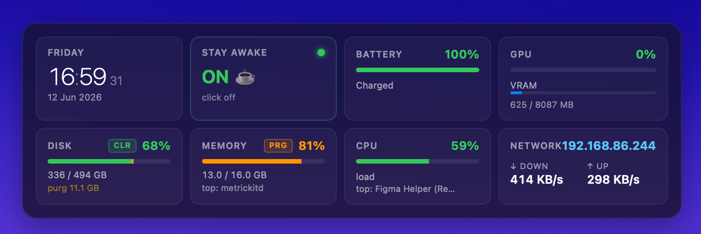

# Übersicht Panel



System dashboard for macOS Apple Silicon — a single 2×4 grid widget that consolidates clock, stay-awake toggle, battery, GPU, disk, memory, CPU, and network into one draggable panel. Each metric is also available as a standalone widget if you prefer to spread them across the desktop.

## Features

| Cell | Live data | Click action |
|------|-----------|--------------|
| **Clock** | Day · HH:MM:SS · date | — |
| **Stay Awake** | `caffeinate -dimsu` toggle (ON ☕ / OFF 💤) | click cell to toggle |
| **Battery** | % · charging · time remaining | — |
| **GPU** | Util % (Apple Silicon delta-sampled) + VRAM bar | — |
| **Disk** | Used · purgeable bar · totals | `CLR` thins Time Machine local snapshots |
| **Memory** | % · top hog · used/total | `PRG` runs `sudo purge` (admin prompt) |
| **CPU** | % · top process | — |
| **Network** | ↓ down + ↑ up KB/s · local IP | aggregates `en*` + `utun*` (VPN) |

All widgets draggable, snap to edges/center/neighbours, position persisted in `localStorage`.

## Requirements

- macOS 13+ on Apple Silicon (M1/M2/M3/M4)
- [Übersicht.app](https://tracesof.net/uebersicht/) — desktop widget engine
- Xcode Command Line Tools — for the Swift disk helper (`xcode-select --install`)
- Git + [`gh` CLI](https://cli.github.com/) (only for the clone-via-gh option)

---

## Install — step by step

### 1. Install Übersicht

```bash
brew install --cask ubersicht
```

Or download the `.app` from <https://tracesof.net/uebersicht/> and drag into `/Applications/`.

Launch it once so it creates `~/Library/Application Support/Übersicht/widgets/`.

### 2. Install Xcode CLT (if not present)

```bash
xcode-select -p >/dev/null 2>&1 || xcode-select --install
```

A GUI prompt may appear — accept and wait for it to finish before continuing.

### 3. Clone this repo

```bash
gh repo clone jferracini/ubersicht-panel-monitoring ~/dev/ubersicht-panel-monitoring
# or, without gh:
# git clone https://github.com/jferracini/ubersicht-panel-monitoring.git ~/dev/ubersicht-panel-monitoring
```

### 4. Run the installer

```bash
cd ~/dev/ubersicht-panel-monitoring
chmod +x install.sh uninstall.sh
./install.sh
```

The installer:
- symlinks each `.jsx` and `.swift` from `widgets/` into `~/Library/Application Support/Übersicht/widgets/`
- backs up any existing widget with the same name to `<name>.bak.<timestamp>`
- launches Übersicht

Symlinks mean future `git pull` updates apply live — no copy step.

### 5. Grant permissions (first run only)

Übersicht needs:
- **Screen Recording** — to render on the desktop. macOS will prompt; allow it in *System Settings → Privacy & Security → Screen Recording*, then quit and relaunch Übersicht.
- **Automation** — the RAM Purge button uses `osascript` with admin privileges. It will prompt the first time it runs.

If a widget renders blank, open Übersicht menubar → **Open Log** to inspect errors.

### 6. Arrange the panel

- Drag the consolidated panel anywhere — it snaps to edges, screen center, and other widgets.
- Position persists across reboots (stored in browser `localStorage`).
- The 7 standalone widgets are also installed. Disable any you don't want via the Übersicht menubar → **Widgets** → uncheck.

---

## Update

```bash
cd ~/dev/ubersicht-panel-monitoring
git pull
```

Übersicht watches the widgets directory and auto-reloads on file change. No restart needed.

## Uninstall

```bash
cd ~/dev/ubersicht-panel-monitoring
./uninstall.sh
```

Removes only the symlinks created by `install.sh`. The repo and Übersicht itself stay.

---

## Files

```
widgets/
├── panel-info.jsx        # consolidated 2×4 dashboard (the hero)
├── clock.jsx
├── stay-awake.jsx
├── battery-info.jsx
├── disk-info.jsx
├── disk-info.swift       # uses volumeAvailableCapacityForImportantUsage (matches Finder)
├── gpu-info.jsx
├── ram-info.jsx
└── cpu-info.jsx
docs/
└── preview.png
install.sh
uninstall.sh
```

## Implementation notes

- **Stay Awake** spawns `nohup caffeinate -dimsu & disown` — survives terminal close, dies on reboot (intentional, prevents leaving it on forever).
- **Disk Clear** runs `tmutil thinlocalsnapshots / 999999999999 4` — no sudo needed.
- **RAM Purge** runs `sudo purge` via `osascript -e 'do shell script ... with administrator privileges'`.
- **Network** aggregates all `en[0-9]+` (physical) and `utun[0-9]+` (VPN tunnels — Palo Alto GlobalProtect, Wireguard, etc.). Excludes `Link` rows. Delta-sampled over a 500 ms window.
- **GPU** uses cumulative `busy_ms` delta from `ioreg PerformanceStatistics` over 500 ms — Apple Silicon reports `Device Utilization %` as 0 when the GPU sleeps deeply, so the instant value is misleading.
- **Refresh** = 3 s for the combined panel, individual widgets keep their original rates (1–30 s).

## License

MIT. Do whatever.
