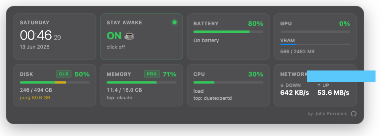

# Übersicht Panel Monitoring



System monitor for your Mac desktop — clock, battery, CPU, RAM, GPU, disk, and network in one panel.

> **Requires an Apple Silicon Mac** (M1 / M2 / M3 / M4) running macOS 13 or later.

---

## Install

### Step 1 — Download Übersicht

Übersicht is the app that makes desktop widgets possible.

👉 Go to **https://tracesof.net/uebersicht/**  
Download the app and drag it into your **Applications** folder.

---

### Step 2 — Clone and install

Open **Terminal** → press `⌘ Space`, type `Terminal`, press Enter.

Paste these two commands, pressing Enter after each:

```bash
git clone https://github.com/jferracini/ubersicht-panel-monitoring.git ~/ubersicht-panel-monitoring
```

```bash
~/ubersicht-panel-monitoring/install.sh
```

The installer will automatically:
- Install Übersicht if it's not already on your Mac
- Set up all widgets
- Show only the main panel (individual widgets are hidden by default)
- Open Übersicht

---

### Step 4 — Allow Screen Recording (one-time only)

macOS requires you to grant permission before Übersicht can draw on your desktop.

The installer will open **System Settings → Screen Recording** automatically.

Übersicht won't appear in the list on its own — you need to add it:

1. Click the **+** button at the bottom of the list
2. Navigate to **Applications**
3. Select **Übersicht.app** → click **Open**
4. Toggle **Übersicht ON**
5. Go back to Terminal and press **Enter**

The panel will appear on your desktop. ✓

> This step only happens once. Running the installer again in the future won't ask for it.

---

## Using the panel

| Cell | What it shows | Tap to… |
|------|--------------|---------|
| **Clock** | Day, time, date | — |
| **Stay Awake** | Whether your Mac can sleep | Toggle sleep on/off |
| **Battery** | Charge %, status, time left | — |
| **GPU** | Usage % and VRAM | — |
| **Disk** | Space used, purgeable | **CLR** — free up purgeable space |
| **Memory** | RAM used, top app | **PRG** — clear inactive RAM |
| **CPU** | Usage %, top process | — |
| **Network** | Download/upload speed, IP | — |

**Drag** the panel anywhere on your desktop — its position is saved automatically and restored after restart.

---

## Manage widgets

Click the **Übersicht icon** in your menu bar to show or hide individual widgets.  
By default only the main panel is visible. The 7 individual widgets (clock, battery, etc.) are hidden and can be enabled there if you want them separately.

---

## Update

```bash
cd ~/ubersicht-panel-monitoring && git pull && ./install.sh
```

Übersicht detects file changes automatically — widgets reload without restart.

---

## Vibe Code Utilities

A second panel for developers — enable it from the Übersicht menu bar.

| Section | What it shows |
|---------|--------------|
| **Dev Ports** | Active dev servers (Vite, Next, Ollama, bun…) with one-click **KILL** |
| **AI Processes** | Running AI tools (Claude, Cursor, Copilot, Ollama…) with CPU/RAM |
| **Git Repos** | Branch + change count for repos in `~/Sites`, `~/dev`, `~/Developer` |
| **Docker** | Running containers (shown only if Docker is installed) |

To enable: click the **Übersicht icon** in the menu bar → `vibe-code-jsx` → enable.

---

## Uninstall

```bash
~/ubersicht-panel-monitoring/uninstall.sh
```

This removes the widgets from your desktop. Übersicht stays installed.

---

## License

MIT — do whatever you want.
